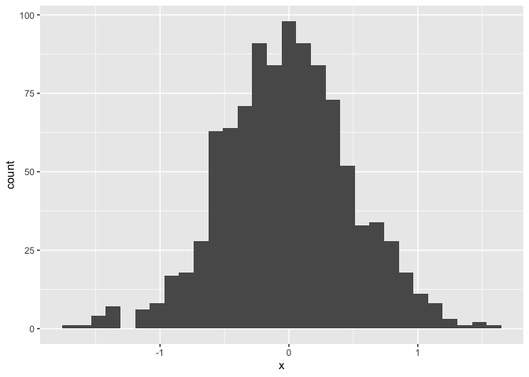

HW_1
================
nr2774
2022-09-22

# Problem_1

``` r
data("penguins", package = "palmerpenguins")
penguins
```

    ## # A tibble: 344 × 8
    ##    species island    bill_length_mm bill_depth_mm flipper_…¹ body_…² sex    year
    ##    <fct>   <fct>              <dbl>         <dbl>      <int>   <int> <fct> <int>
    ##  1 Adelie  Torgersen           39.1          18.7        181    3750 male   2007
    ##  2 Adelie  Torgersen           39.5          17.4        186    3800 fema…  2007
    ##  3 Adelie  Torgersen           40.3          18          195    3250 fema…  2007
    ##  4 Adelie  Torgersen           NA            NA           NA      NA <NA>   2007
    ##  5 Adelie  Torgersen           36.7          19.3        193    3450 fema…  2007
    ##  6 Adelie  Torgersen           39.3          20.6        190    3650 male   2007
    ##  7 Adelie  Torgersen           38.9          17.8        181    3625 fema…  2007
    ##  8 Adelie  Torgersen           39.2          19.6        195    4675 male   2007
    ##  9 Adelie  Torgersen           34.1          18.1        193    3475 <NA>   2007
    ## 10 Adelie  Torgersen           42            20.2        190    4250 <NA>   2007
    ## # … with 334 more rows, and abbreviated variable names ¹​flipper_length_mm,
    ## #   ²​body_mass_g

``` r
nrow(penguins)
```

    ## [1] 344

``` r
ncol(penguins)
```

    ## [1] 8

``` r
df = penguins

mean (df$flipper_length_mm, na.rm = TRUE)
```

    ## [1] 200.9152

-   Data in this dataset is about penguins which are Adeilie types and
    are from island called Torgersen. Valeues are included bill length,
    bill depth, flipper length and body mass , sex, and year.

-   The number of rows are 344 The number of colums are 8 The mean
    flipper length is 200.9152

``` r
library(tidyverse)
```

    ## ── Attaching packages ─────────────────────────────────────── tidyverse 1.3.2 ──
    ## ✔ ggplot2 3.3.6     ✔ purrr   0.3.4
    ## ✔ tibble  3.1.8     ✔ dplyr   1.0.9
    ## ✔ tidyr   1.2.0     ✔ stringr 1.4.1
    ## ✔ readr   2.1.2     ✔ forcats 0.5.2
    ## ── Conflicts ────────────────────────────────────────── tidyverse_conflicts() ──
    ## ✖ dplyr::filter() masks stats::filter()
    ## ✖ dplyr::lag()    masks stats::lag()

``` r
scatterplot = ggplot(penguins, aes(x = bill_length_mm,
                                   y = flipper_length_mm, 
                                   col = species)) + geom_point()

scatterplot
```

    ## Warning: Removed 2 rows containing missing values (geom_point).

<!-- -->

``` r
ggsave("HW1scatterplot.pdf", plot = scatterplot )
```

    ## Saving 7 x 5 in image

    ## Warning: Removed 2 rows containing missing values (geom_point).

``` r
library(tidyverse)

Data_frame = tibble(
  vec_norm = rnorm(10),
  vec_logical = vec_norm>0,
  vec_char = c("a", "b", "c", "a", "b", "c", "a", "b", "c", "d"),
  vec_factor = factor(c("low", "medium", "high", "low", "medium", "high",
                        "low", "medium", "high", "low"), levels= c( "low", "medium", "high"))

)

mean (Data_frame$vec_norm, na.rm = TRUE)
```

    ## [1] -0.1953596

``` r
mean (Data_frame$vec_logical, na.rm = TRUE)
```

    ## [1] 0.4

``` r
mean (Data_frame$vec_char, na.rm = TRUE)
```

    ## Warning in mean.default(Data_frame$vec_char, na.rm = TRUE): argument is not
    ## numeric or logical: returning NA

    ## [1] NA

``` r
mean (Data_frame$factor, na.rm = TRUE)
```

    ## Warning: Unknown or uninitialised column: `factor`.

    ## Warning in mean.default(Data_frame$factor, na.rm = TRUE): argument is not
    ## numeric or logical: returning NA

    ## [1] NA

\*\*Take the mean of vec for logical indicates that proprtion of people
who got the treatment

The purpose of this file is to present a couple of basic plots using
`ggplot`.

First we create a dataframe containing variables for our plots.

``` r
set.seed(1234)

plot_df = tibble(
  x = rnorm(1000, sd = .5),
  y = 1 + 2 * x + rnorm(1000)
)
```

First we show a histogram of the `x` variable.

``` r
ggplot(plot_df, aes(x = x)) + geom_histogram()
```

    ## `stat_bin()` using `bins = 30`. Pick better value with `binwidth`.

<!-- -->

Next we show a scatterplot of `y` vs `x`.

``` r
ggplot(plot_df, aes(x = x, y = y)) + geom_point()
```

<!-- -->
